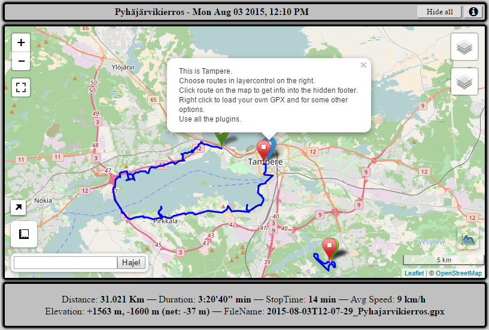

# Leaflet-GPX-Map
### Leaflet map to show gpx tracks with some additional plugins.

### v3 Todo
* remove footer & title
* sidebar configuration + button
* clean up css
* remove fullscreen button

Few example GPX tracks included.

[Live demo here](https://fraasi.github.io/Leaflet-GPX-Map/)

[Leaflet](https://leafletjs.com) & Plugins used:

Leaflet Control OSM Geocoder
https://github.com/k4r573n/leaflet-control-osm-geocoder

GPX plugin for Leaflet
https://github.com/mpetazzoni/leaflet-gpx

Leaflet-MiniMap
https://github.com/Norkart/Leaflet-MiniMap

Leaflet.fullscreen
https://github.com/Leaflet/Leaflet.fullscreen

leaflet-measure
https://github.com/ljagis/leaflet-measure

Leaflet.Elevation
https://github.com/MrMufflon/Leaflet.Elevation

Leaflet.contextmenu
https://github.com/aratcliffe/Leaflet.contextmenu

leaflet-sidebar
https://github.com/Turbo87/leaflet-sidebar

Leaflet.EasyButton
https://github.com/CliffCloud/Leaflet.EasyButton

